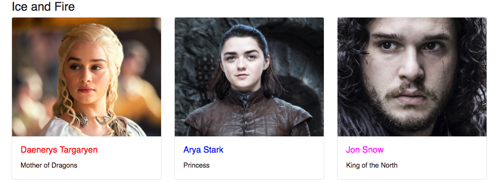

# Exercice 13 : Components

## Instructions

Nous souhaitons créer une carte permettant d'afficher un personnage.

* Remplacer le composant `App` par un Stateless Functional Component
* Ajouter bootstrap dans le fichier `public/index.html` :

```html
<link rel="stylesheet" href="https://maxcdn.bootstrapcdn.com/bootstrap/4.0.0/css/bootstrap.min.css">
```

* Créer un dossier `src/components` qui contiendra plusieurs composants

  * `Card` : `<div className="card">{children}</div>`
  * `CardBody` : `<div className="card-body">{children}</div>`
  * `CardText` : `<p className="card-text">{children}</p>`
  * `CardTitle` : `<h5 className="card-title">{children}</h5>`
  * `CardImg` : ``

* Créer un composant `CharacterCard`

  * Il acceptera une propriété `character`
  * Il utilisera les composants pour afficher une carte, en titre le nom du personnage, en texte le titre du personnage
  * Le titre du personnage devra prendre la couleur correspondant à son élément

* Déplacer le fichier `Character.mjs` (créé dans les exercices précédents) dans le dossier `src`
* Modifier la classe `Character` pour qu'elle accepte une propriété `picture`
* Afficher tous les personnages dans `App.js`

**Résultat attendu**



## Aide

```js
// App.js
import React from 'react'
import './App.css'
import CharacterCard from './CharacterCard'
import Character from './Character'

const characters = [
  new Character({
    name: 'Daenerys Targaryen',
    title: 'Mother of Dragons',
    picture:
      'http://res.cloudinary.com/smooth/image/upload/c_fill,g_face,h_400,w_500,dpr_2/v1500972396/training_react_daenerys_targaryen.png',
  }),
  new Character({
    name: 'Arya Stark',
    title: 'Princess',
    picture:
      'http://res.cloudinary.com/smooth/image/upload/c_fill,g_face,h_400,w_500,dpr_2/v1500972396/training_react_arya_stark.png',
  }),
  new Character({
    name: 'Jon Snow',
    title: 'King of the North',
    picture:
      'http://res.cloudinary.com/smooth/image/upload/c_fill,g_face,h_400,w_500,dpr_2/v1500972396/training_react_jon_snow.png',
  }),
]

const App = () => (
  <div className="container">
    <header className="header">
      <h3>Ice and Fire</h3>
    </header>
    <section className="content">
      <div className="row">
        {characters.map(character => (
          <div className="col-md-4" key={/* TODO */}>
            /* TODO */
          </div>
        ))}
      </div>
    </section>
  </div>
)

export default App
```

```js
// Card.js
import React from 'react'

const Card = ({ children, ...props }) => (
  <div className="card" {...props}>
    {children}
  </div>
)

export default Card
```

Structure d'une Card :

```js
// CharacterCard.js
import React from 'react'
import Card from './components/Card'
import CardBody from './components/CardBody'
import CardImg from './components/CardImg'
import CardText from './components/CardText'
import CardTitle from './components/CardTitle'

const CharacterCard = ({ character }) => (
  <Card>
    <CardImg src={/* TODO */} alt={/* TODO */} />
    <CardBody>
      <CardTitle style={{color: /* TODO */ }}>{/* TODO */}</CardTitle>
      <CardText>{/* TODO */}</CardText>
    </CardBody>
  </Card>
)

export default CharacterCard
```
