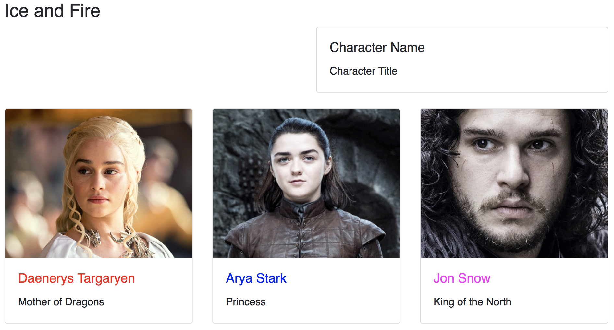

# Exercice 16 - State

## Instructions

Nous souhaitons créer un éditeur de personnages comportant un formulaire et une preview. Dans cette première partie nous allons nous concentrer sur le composant global.

* Créer un composant `CharacterEditor`
  * Un state comportant une propriété `character`
  * Un rendu comportant deux colonnes, la première restera vide et la seconde contiendra une `CharacterCard`

```js
<div className="row mb-4">
  <div className="col-sm" />
  <div className="col-sm">/* TODO */</div>
</div>
```

* Mettre à jour le composant `CharacterdCard` pour ne pas afficher l'image si le caractère n'a pas de propriété `picture`
* Ajouter le composant `CharacterEditor` dans le composant `App`

**Résultat attendu**


