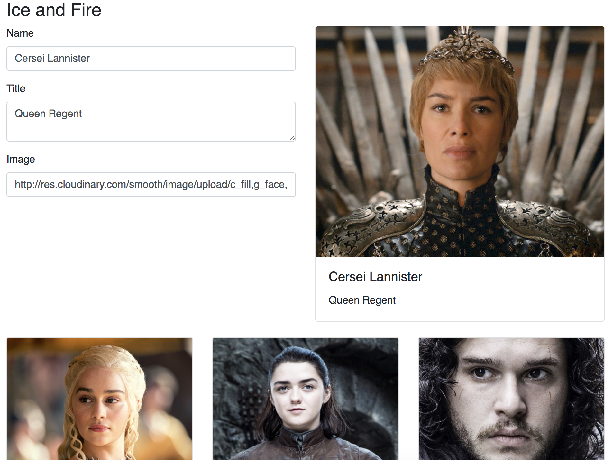

# Exercice 17 - Formulaires

## Instructions

Nous souhaitons maintenant créer un formulaire permettant d'éditer un personnage.

* Créer un composant `FormGroup` (voir aide)
* Créer un composant `CharacterForm` contrôlé, il acceptera donc deux propriétés :

  * `value`, le personnage représenté dans le formulaire
  * `onChange`, une fonction appelée à chaque changement du personnage (attention aux mutations !!)

* Ajouter le composant `CharacterForm` dans `CharacterEditor` en prenant soin de le connecter au `state` avec une fonction `handleChange`

**Résultat attendu**



## Aide

```js
// FormGroup.js
import React from 'react'

const FormGroup = ({ children, ...props }) => (
  <div className="form-group" {...props}>
    {children}
  </div>
)

export default FormGroup
```

```js
import React from 'react'

// Exemple de formulaire contrôlé pour vous inspirer
class ControlledForm extends React.Component {
  handleNameChange = event => {
    this.props.onChange({
      ...this.props.value,
      name: event.target.value,
    })
  }

  render() {
    return (
      <form>
        <FormGroup>
          <label htmlFor="name">Name</label>
          <input
            onChange={this.handleNameChange}
            value={this.props.value.name}
            className="form-control"
            id="name"
            placeholder="Enter name"
          />
        </FormGroup>
      </form>
    )
  }
}
```
